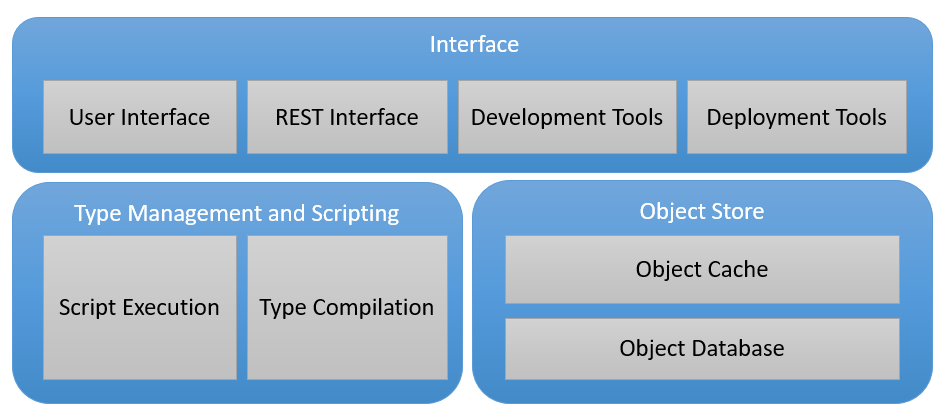

Tesseract is a enterprise solution for flexible, high performant applictions based on an object store and scripting

The following topics describe the 5 major components in the architecture. It is recommended to read the topics in the following order:

- [Object Store](object-store/ObjectStore.md)
- [Compilation and Scripting](types-and-scripting/CompilationAndScripting.md)
- [Interface](interface/Interface.md)
- [Development Tools](development/DevelopmentTools.md)
- [Deployment Tools](deployment/DeploymentTools.md)
  